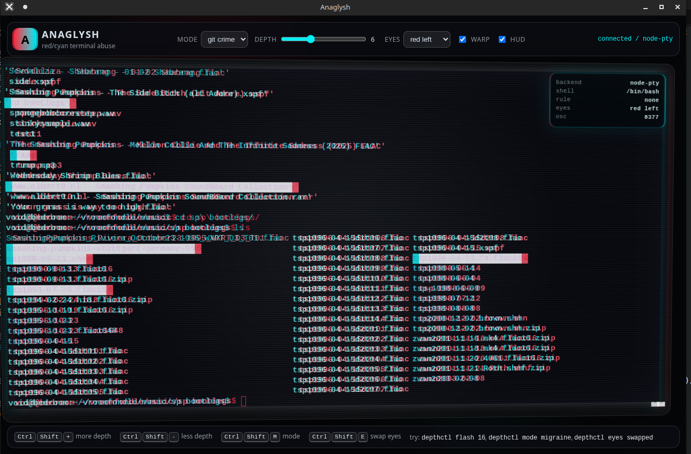

# Anaglysh

A red/cyan anaglyph terminal emulator nobody asked for.

It is intentionally stupid, but it is not fake: it uses a PTY backend, xterm.js for terminal emulation, and two chromatically shifted render layers to make your shell look like it fell out of a 1950s sci-fi cereal box.

## Screenshot



## What it does

- Runs your real shell through `node-pty`.
- Renders the same terminal buffer twice with xterm.js.
- Shifts the red and cyan layers apart for anaglyph depth.
- Defaults to standard paper-glasses order: red lens left, cyan/blue lens right.
- Includes a one-click eye-order swap for reversed glasses or inverted depth.
- Watches terminal output for cursed events like `ERROR`, `sudo`, `rm -rf`, and git conflict markers.
- Temporarily shoves those events forward in depth.
- Includes `depthctl`, a tiny OSC control command available inside the spawned shell.
- Runs as either an Electron desktop app or a browser-based local app.

## Why the architecture is this shape

`node-pty` provides forkpty-style pseudo-terminal bindings, which makes real terminal programs believe they are attached to a terminal. xterm.js is the browser terminal front-end used for full terminal emulation. Anaglysh keeps those jobs separate: the backend owns the PTY; the frontend owns the irresponsible stereoscopic rendering.

## Requirements

- Node.js 20+
- npm
- Build tools for `node-pty`

On Debian/Ubuntu-ish systems:

```bash
sudo apt update
sudo apt install -y build-essential python3 make g++
```

On Windows, install Visual Studio Build Tools with the C++ workload.

## Install

```bash
git clone <your repo url> anaglysh
cd anaglysh
npm install
npm run doctor
```

## Run desktop app

```bash
npm run dev
```

That starts:

1. the local PTY server on `127.0.0.1:3333`
2. Vite on `127.0.0.1:5173`
3. Electron pointed at the Vite UI

For a built version:

```bash
npm start
```

## Run in browser instead

```bash
npm run web
```

Then open:

```text
http://127.0.0.1:5173
```


## Linux Electron sandbox failure

On some Linux systems, Electron may abort with this message:

```text
The SUID sandbox helper binary was found, but is not configured correctly.
You need to make sure that node_modules/electron/dist/chrome-sandbox is owned by root and has mode 4755.
```

Preferred fix if you are comfortable granting the Electron sandbox helper its expected setuid permissions:

```bash
sudo chown root:root node_modules/electron/dist/chrome-sandbox
sudo chmod 4755 node_modules/electron/dist/chrome-sandbox
npm run dev
```

Development-only workaround:

```bash
npm run dev:nosandbox
```

Browser-only workaround, avoiding Electron entirely:

```bash
npm run web
# open http://127.0.0.1:5173
```

Do not expose the PTY server outside localhost. It is intentionally a local shell server.

## Controls

| Control | Effect |
|---|---|
| Mode dropdown | Switches between tolerable and legally questionable presets |
| Depth slider | Sets red/cyan separation |
| Eyes dropdown | Switches between red-left and cyan-left lens order |
| Warp checkbox | Toggles perspective tilt |
| HUD checkbox | Hides the stupid little cockpit overlay |
| Ctrl+Shift++ | Increase depth |
| Ctrl+Shift+- | Decrease depth |
| Ctrl+Shift+M | Cycle modes |
| Ctrl+Shift+E | Swap eye/color order |

## Color order / depth looks backwards

Most red/cyan glasses use red on the left eye and cyan/blue on the right eye. Anaglysh now defaults to that order and pushes positive depth toward the viewer by shifting red right and cyan left.

If the effect looks inside-out, use the `eyes` dropdown or run:

```bash
depthctl eyes swapped
```

Switch back with:

```bash
depthctl eyes standard
```

## `depthctl`

The PTY server prepends this repo's `bin/` directory to `PATH`, so spawned shells can run `depthctl` directly.

```bash
depthctl flash 16
depthctl mode migraine
depthctl set 3
depthctl warp off
depthctl eyes swapped
depthctl banner hello from the eye crime layer
```

This works by emitting a private OSC sequence:

```text
ESC ] 8377 ; depth=8 BEL
```

The renderer catches that sequence and changes the anaglyph effect without printing the escape code.

## Depth rules

Edit:

```text
config/depth-rules.json
```

Example:

```json
{
  "name": "error accusation layer",
  "pattern": "\\b(ERROR|FATAL|Traceback|Exception)\\b",
  "flags": "i",
  "depth": 10,
  "durationMs": 1500,
  "shake": false
}
```

Restart the server after changing the rules.

## Notes

- If `node-pty` fails to install, the server falls back to degraded pipe mode. Basic commands may work, but curses applications like `vim`, `top`, and `tmux` will be bad. Install the native build tools and reinstall dependencies.
- The renderer duplicates the terminal visually. The red terminal is the controlling input layer; the cyan terminal is a synchronized visual duplicate.
- This is a local app. Do not expose the PTY server port to a network unless you want a shell-shaped security incident.

## License

MIT.
